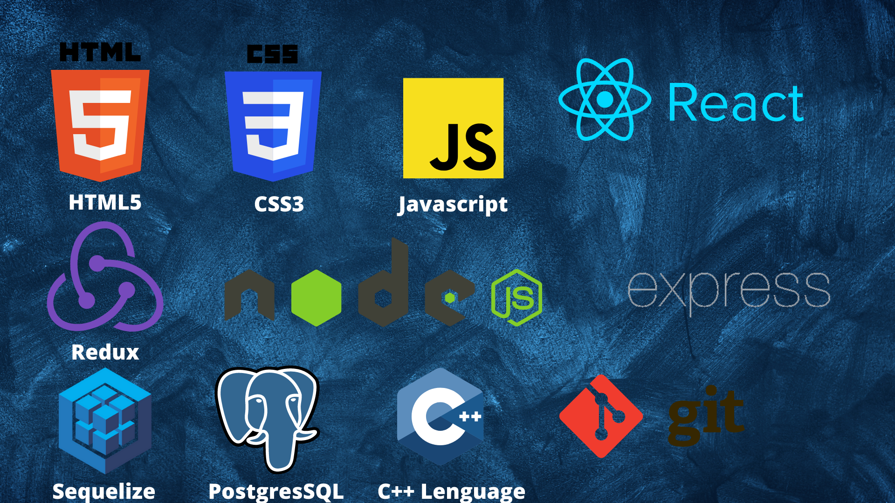

### Hi there, welcome to my gitHub profile 👋

 

🔭 I’m currently on the final steps with a eCommerce web 2.0, with my friends from Henry Bootcamp from Argentina. I'm a Full Stack Developer, but I work better on the back side 😄

 

## Languages and Tools:

<!--
**FEDEIZ/FEDEIZ** is a ✨ _special_ ✨ repository because its `README.md` (this file) appears on your GitHub profile.

Here are some ideas to get you started:

- 🔭 I’m currently working on ...
- 🌱 I’m currently learning ...
- 👯 I’m looking to collaborate on ...
- 🤔 I’m looking for help with ...
- 💬 Ask me about ...
- 📫 How to reach me: ...
- 😄 Pronouns: ...
- ⚡ Fun fact: ...
  -->

## My projects

### Tecnomerch

 Tech store where you can get authenticate, buy differents products and fill your personal data so the ship can arrive to your home. The buy can be done througth Mercado Pago, a secure and well know plataform to do money transactions.
  
  
  
  

### Countries web

 In this website you can create activities turistics cadrs for differents countries before you go on holidays, so you can check them from any where you want. You can also see the countries details, that brings an external countries API"
  
  
  

