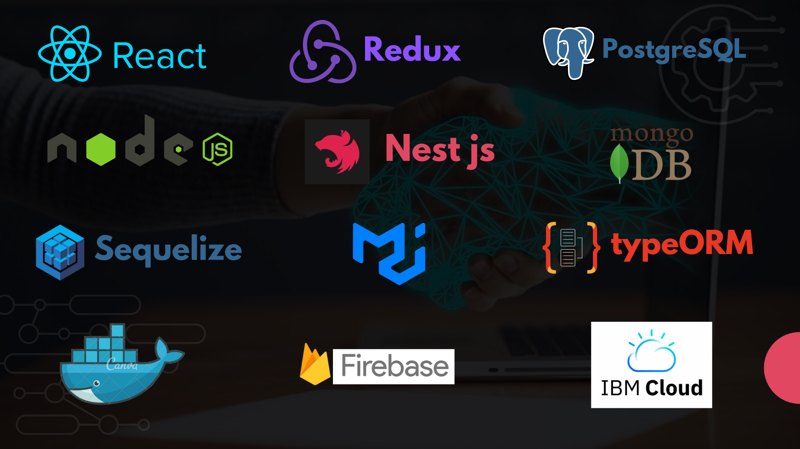

## Full stack developer and Electronic Engineer from 🇦🇷

### Tech Lead on YvY Project - Fundacion Plan 21 👋

 

🔭 I currently work as a technical leader in a project called YvY App of Fundacion Plan 21. It is a free web application designed to offer solutions for regenerative agriculture, with the aim of facilitating small and medium-sized producers in Latin America to digitalize their production. on farms with a focus on regenerative and sustainable agriculture, complying with international standards.

YvY was a finalist in IBM's Call For Code competition launched with the objective of encouraging organizations to build solutions to reduce environmental impact in the world. Together with IBM and the Plan 21 Foundation team, we developed the YvY application, being the tech lead of a development team with members of IBM and private volunteers.

 

## 🔧 Languages and Tools:

## 🚀 My projects

### YvY App - A solution for Regenerative Agriculture
Check this tutorials video to understand YvY App and feel free to create an account to use it!

[Here's the free web app YvY!](https://yvyapp.plan21.org/)

Tech & Tools used for YvY:

<ul>
    <li>React - Redux with Material UI</li>
    <li>Node Js & Express with Typescript</li>
    <li>TypeORM & PostgresSQL</li>
    <li>Docker</li>
    <li>IBM Cloud services for Containers and Cloud Object Storage</li>
    <li>Github Action</li>
    <li>Integration: Meteostat and Weather Api as External API's</li>
    <li>AI: Wattson Chat Assistant as Chat-bot</li>
</ul>

### 🛒 Tecnomerch

 Tech store where you can get authenticate, buy differents products and fill your personal data so the ship can arrive to your home. The buy can be done througth Mercado Pago, a secure and well know plataform to do money transactions.
  
  
  
  

Tech & Tools used for this projects:

<ul>
    <li>React - Redux Toolkit</li>
    <li>CSS for styling</li>
    <li>Node Js & Express</li>
    <li>Sequelize & PostgresSQL</li>
    <li>Auth0 services for authentication</li>
    <li>Mercado Pago services for buying</li>
    <li>Cloudinary services for images storing</li>
    <li>Own server for deploy</li>
</ul>

[**¡Visit the Tecnomerch web in here!**](https://tecnomerch.christianvillegas.com/)

My great team:
    <ul>
        <li><a href="https://github.com/chrisvill2312">Chris</a></li>
        <li><a href="https://github.com/francoSerafini">Fran</a></li>
        <li><a href="https://github.com/MatiVillagra98">Mati</a></li>
        <li><a href="https://github.com/ProfesorJand">Jorge</a></li>
        <li><a href="https://github.com/ramijujuy">Rama</a></li>
        <li><a href="https://github.com/villajul">Julio</a></li>
    </ul>

## 📫 ¿How you can reach me?

<a href="https://www.linkedin.com/in/federicoiz93/" > 
<a href="mailto:ing.finterlandi@gmail.com" >

